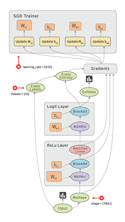
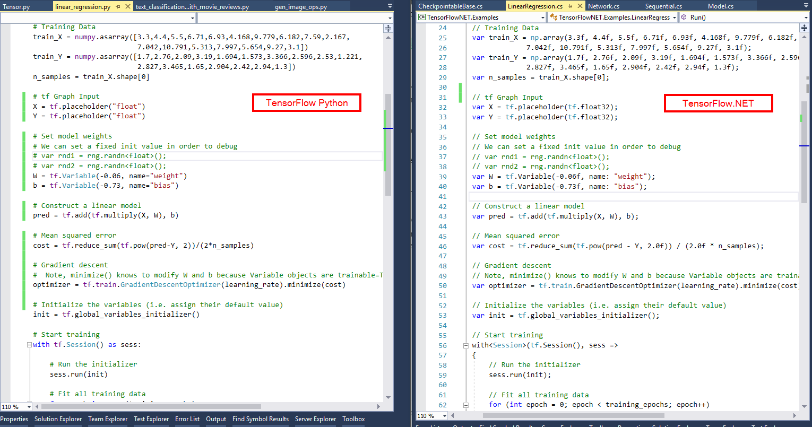

**TensorFlow.NET** (TF.NET) provides a .NET Standard binding for [TensorFlow](https://www.tensorflow.org/). It aims to implement the complete Tensorflow API in C# which allows .NET developers to develop, train and deploy Machine Learning models with the cross-platform .NET Standard framework. TensorFlow.NET has built-in Keras high-level interface and is released as an independent package [TensorFlow.Keras](https://www.nuget.org/packages/TensorFlow.Keras/).

[](https://gitter.im/sci-sharp/community)
[](https://ci.appveyor.com/project/Haiping-Chen/tensorflow-net)
[](https://www.nuget.org/packages/TensorFlow.NET)
[](https://tensorflownet.readthedocs.io/en/latest/?badge=latest)
[](https://996.icu/#/en_US)
[](https://mybinder.org/v2/gh/javiercp/BinderTF.NET/master?urlpath=lab)

*master branch is based on tensorflow 2.3 now, v0.15-tensorflow1.15 is from tensorflow1.15.*




### Why TensorFlow in C# and F# ?

`SciSharp STACK`'s mission is to bring popular data science technology into the .NET world and to provide .NET developers with a powerful Machine Learning tool set without reinventing the wheel. Since the APIs are kept as similar as possible you can immediately adapt any existing Tensorflow code in C# or F# with a zero learning curve. Take a look at a comparison picture and see how comfortably a Tensorflow/Python script translates into a C# program with TensorFlow.NET.



SciSharp's philosophy allows a large number of machine learning code written in Python to be quickly migrated to .NET, enabling .NET developers to use cutting edge machine learning models and access a vast number of Tensorflow resources which would not be possible without this project.

In comparison to other projects, like for instance [TensorFlowSharp](https://www.nuget.org/packages/TensorFlowSharp/) which only provide Tensorflow's low-level C++ API and can only run models that were built using Python, Tensorflow.NET also implements Tensorflow's high level API where all the magic happens. This computation graph building layer is still under active development. Once it is completely implemented you can build new Machine Learning models in C# or F#. 

### How to use

| TensorFlow                 | tf native1.14 | tf native 1.15 | tf native 2.3 |
| -------------------------- | ------------- | -------------- | ------------- |
| tf.net 0.3x, tf.keras 0.2 |               |                | x             |
| tf.net 0.2x                |               | x              | x             |
| tf.net 0.15                | x             | x              |               |
| tf.net 0.14                | x             |                |               |

Troubleshooting of running example or installation, please  refer [here](tensorflowlib/README.md).

There are many examples reside at [TensorFlow.NET Examples](https://github.com/SciSharp/TensorFlow.NET-Examples) written in C# and F#.

#### C# Example

Install TF.NET and TensorFlow binary through NuGet.
```sh
### install tensorflow C#/F# binding
PM> Install-Package TensorFlow.NET
### install keras for tensorflow
PM> Install-Package TensorFlow.Keras

### Install tensorflow binary
### For CPU version
PM> Install-Package SciSharp.TensorFlow.Redist

### For GPU version (CUDA and cuDNN are required)
PM> Install-Package SciSharp.TensorFlow.Redist-Windows-GPU
```

Import TF.NET and Keras API in your project.

```cs
using static Tensorflow.Binding;
using static Tensorflow.KerasApi;
```

Linear Regression in `Eager` mode:

```c#
// Parameters        
var training_steps = 1000;
var learning_rate = 0.01f;
var display_step = 100;

// Sample data
var train_X = np.array(3.3f, 4.4f, 5.5f, 6.71f, 6.93f, 4.168f, 9.779f, 6.182f, 7.59f, 2.167f,
             7.042f, 10.791f, 5.313f, 7.997f, 5.654f, 9.27f, 3.1f);
var train_Y = np.array(1.7f, 2.76f, 2.09f, 3.19f, 1.694f, 1.573f, 3.366f, 2.596f, 2.53f, 1.221f,
             2.827f, 3.465f, 1.65f, 2.904f, 2.42f, 2.94f, 1.3f);
var n_samples = train_X.shape[0];

// We can set a fixed init value in order to demo
var W = tf.Variable(-0.06f, name: "weight");
var b = tf.Variable(-0.73f, name: "bias");
var optimizer = tf.optimizers.SGD(learning_rate);

// Run training for the given number of steps.
foreach (var step in range(1, training_steps + 1))
{
    // Run the optimization to update W and b values.
    // Wrap computation inside a GradientTape for automatic differentiation.
    using var g = tf.GradientTape();
    // Linear regression (Wx + b).
    var pred = W * X + b;
    // Mean square error.
    var loss = tf.reduce_sum(tf.pow(pred - Y, 2)) / (2 * n_samples);
    // should stop recording
    // Compute gradients.
    var gradients = g.gradient(loss, (W, b));

    // Update W and b following gradients.
    optimizer.apply_gradients(zip(gradients, (W, b)));

    if (step % display_step == 0)
    {
        pred = W * X + b;
        loss = tf.reduce_sum(tf.pow(pred - Y, 2)) / (2 * n_samples);
        print($"step: {step}, loss: {loss.numpy()}, W: {W.numpy()}, b: {b.numpy()}");
    }
}
```

Run this example in [Jupyter Notebook](https://github.com/SciSharp/SciSharpCube).

Toy version of `ResNet` in `Keras` functional API:

```csharp
// input layer
var inputs = keras.Input(shape: (32, 32, 3), name: "img");

// convolutional layer
var x = layers.Conv2D(32, 3, activation: "relu").Apply(inputs);
x = layers.Conv2D(64, 3, activation: "relu").Apply(x);
var block_1_output = layers.MaxPooling2D(3).Apply(x);

x = layers.Conv2D(64, 3, activation: "relu", padding: "same").Apply(block_1_output);
x = layers.Conv2D(64, 3, activation: "relu", padding: "same").Apply(x);
var block_2_output = layers.add(x, block_1_output);

x = layers.Conv2D(64, 3, activation: "relu", padding: "same").Apply(block_2_output);
x = layers.Conv2D(64, 3, activation: "relu", padding: "same").Apply(x);
var block_3_output = layers.add(x, block_2_output);

x = layers.Conv2D(64, 3, activation: "relu").Apply(block_3_output);
x = layers.GlobalAveragePooling2D().Apply(x);
x = layers.Dense(256, activation: "relu").Apply(x);
x = layers.Dropout(0.5f).Apply(x);

// output layer
var outputs = layers.Dense(10).Apply(x);

// build keras model
model = keras.Model(inputs, outputs, name: "toy_resnet");
model.summary();

// compile keras model in tensorflow static graph
model.compile(optimizer: keras.optimizers.RMSprop(1e-3f),
	loss: keras.losses.CategoricalCrossentropy(from_logits: true),
	metrics: new[] { "acc" });

// prepare dataset
var ((x_train, y_train), (x_test, y_test)) = keras.datasets.cifar10.load_data();

// training
model.fit(x_train[new Slice(0, 1000)], y_train[new Slice(0, 1000)], 
          batch_size: 64, 
          epochs: 10, 
          validation_split: 0.2f);
```

#### F# Example

Linear Regression in `Eager` mode:

```fsharp
#r "nuget: TensorFlow.Net"
#r "nuget: TensorFlow.Keras"
#r "nuget: SciSharp.TensorFlow.Redist"
#r "nuget: NumSharp"

open NumSharp
open Tensorflow
open type Tensorflow.Binding
open type Tensorflow.KerasApi

let tf = New<tensorflow>()
tf.enable_eager_execution()

// Parameters
let training_steps = 1000
let learning_rate = 0.01f
let display_step = 100

// Sample data
let train_X = 
    np.array(3.3f, 4.4f, 5.5f, 6.71f, 6.93f, 4.168f, 9.779f, 6.182f, 7.59f, 2.167f,
             7.042f, 10.791f, 5.313f, 7.997f, 5.654f, 9.27f, 3.1f)
let train_Y = 
    np.array(1.7f, 2.76f, 2.09f, 3.19f, 1.694f, 1.573f, 3.366f, 2.596f, 2.53f, 1.221f,
             2.827f, 3.465f, 1.65f, 2.904f, 2.42f, 2.94f, 1.3f)
let n_samples = train_X.shape.[0]

// We can set a fixed init value in order to demo
let W = tf.Variable(-0.06f,name = "weight")
let b = tf.Variable(-0.73f, name = "bias")
let optimizer = keras.optimizers.SGD(learning_rate)

// Run training for the given number of steps.
for step = 1 to  (training_steps + 1) do 
    // Run the optimization to update W and b values.
    // Wrap computation inside a GradientTape for automatic differentiation.
    use g = tf.GradientTape()
    // Linear regression (Wx + b).
    let pred = W * train_X + b
    // Mean square error.
    let loss = tf.reduce_sum(tf.pow(pred - train_Y,2)) / (2 * n_samples)
    // should stop recording
    // compute gradients
    let gradients = g.gradient(loss,struct (W,b))

    // Update W and b following gradients.
    optimizer.apply_gradients(zip(gradients, struct (W,b)))

    if (step % display_step) = 0 then
        let pred = W * train_X + b
        let loss = tf.reduce_sum(tf.pow(pred-train_Y,2)) / (2 * n_samples)
        printfn $"step: {step}, loss: {loss.numpy()}, W: {W.numpy()}, b: {b.numpy()}"
```

Read the docs & book [The Definitive Guide to Tensorflow.NET](https://tensorflownet.readthedocs.io/en/latest/FrontCover.html) if you want to know more about TensorFlow for .NET under the hood.

### Contribute:

Feel like contributing to one of the hottest projects in the Machine Learning field? Want to know how Tensorflow magically creates the computational graph? We appreciate every contribution however small. There are tasks for novices to experts alike, if everyone tackles only a small task the sum of contributions will be huge.

You can:
* Let everyone know about this project
* Port Tensorflow unit tests from Python to C# or F#
* Port missing Tensorflow code from Python to C# or F#
* Port Tensorflow examples to C# or F# and raise issues if you come accross missing parts of the API
* Debug one of the unit tests that is marked as Ignored to get it to work
* Debug one of the not yet working examples and get it to work

### How to debug unit tests:

The best way to find out why a unit test is failing is to single step it in C# or F# and its corresponding Python at the same time to see where the flow of execution digresses or where variables exhibit different values. Good Python IDEs like PyCharm let you single step into the tensorflow library code. 

### Git Knowhow for Contributors

Add SciSharp/TensorFlow.NET as upstream to your local repo ...
```git
git remote add upstream git@github.com:SciSharp/TensorFlow.NET.git
```

Please make sure you keep your fork up to date by regularly pulling from upstream. 
```git
git pull upstream master
```

### Contact

Follow us on [Twitter](https://twitter.com/ScisharpStack), [Facebook](https://www.facebook.com/scisharp.stack.9), [Medium](https://medium.com/scisharp), [LinkedIn](https://www.linkedin.com/company/scisharp-stack/).

Join our chat on [Gitter](https://gitter.im/sci-sharp/community).

Scan QR code to join Tencent TIM group:


WeChat Sponsor 微信打赏:


TensorFlow.NET is a part of [SciSharp STACK](https://scisharp.github.io/SciSharp/)
<br>
<a href="http://scisharpstack.org"></a>
